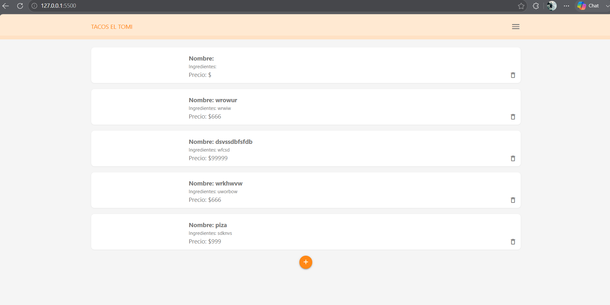
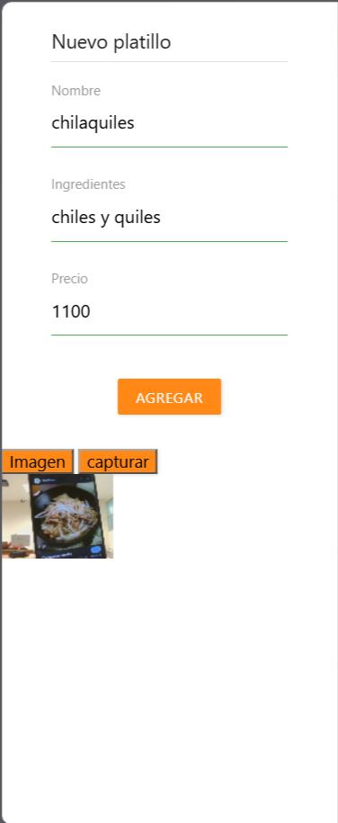
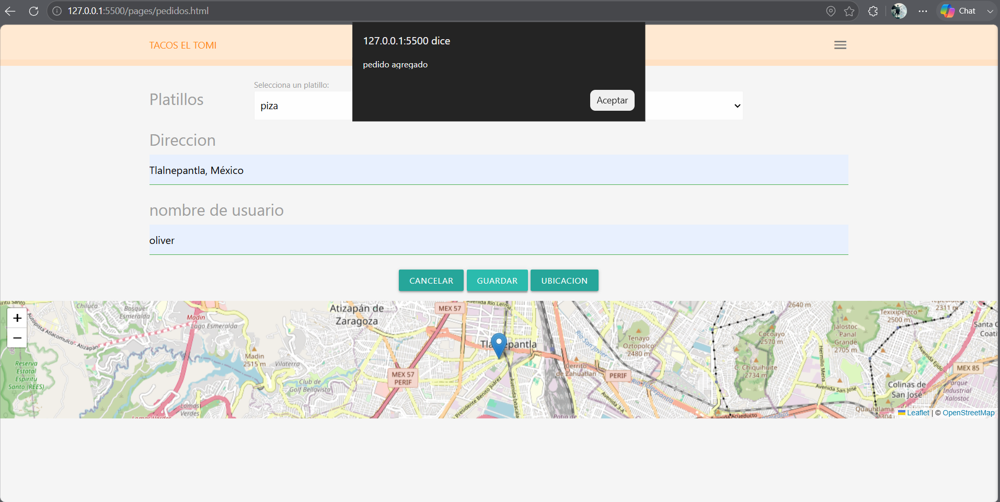
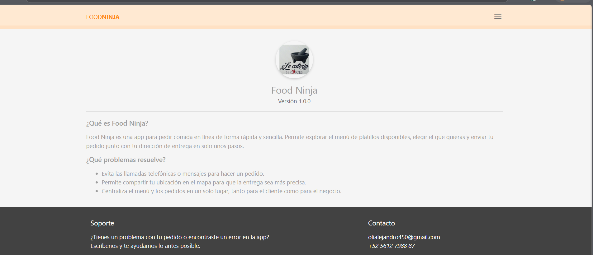
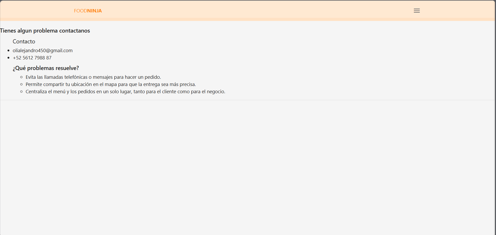

=====================================================

1. Tacos el tomi
   =============

   Nombre de la aplicación: Tacos el tomi
   Descripción breve: Aplicación web para gestionar el menú de platillos de un
   negocio de comida y permitir a los usuarios realizar pedidos con dirección
   de entrega, app similar a uber.

Nombre del proyecto: Tacos el tomi
Tipo de aplicación: Aplicación web

Descripción:
Tacos el tomi permite a un negocio de comida publicar su menú y a los clientes
elegir un platillo, indicar su dirección y
enviar su pedido en pocos pasos.

TALLER DE PROGRAMACIÓN AVANZADA II / ing. sistemas comp. /
Alumno: Pichardo Beltran Oliver Alejandro

=====================================================
2. DESCRIPCIÓN DEL PROYECTO
============================

Tacos el tomi resuelve el problema de tomar pedidos de comida de forma manual
(por teléfono o mensajes), lo cual es lento y propenso a errores tanto para
el negocio como para el cliente. La aplicación centraliza el catálogo de
platillos y el registro de pedidos en una base de datos en tiempo real
(Firebase Firestore), permitiendo que cualquier cambio en el menú se
refleje al instante para todos los usuarios.

Propósito: ofrecer una herramienta simple, rápida y en tiempo real para
digitalizar el proceso de pedidos de un negocio de comida pequeño.

=====================================================
3. OBJETIVOS
============

Objetivo general:
Desarrollar una aplicación web que permita gestionar el menú de platillos
de un negocio de comida y la creación de pedidos por parte de los clientes,
utilizando una base de datos en tiempo real.

Objetivos específicos:

- Implementar un CRUD de platillos (crear, leer, actualizar, eliminar)
  conectado a Firebase Firestore.
- Permitir a los usuarios seleccionar un platillo y registrar un pedido
  con nombre de usuario y dirección de entrega.
- Integrar geolocalización del navegador y un mapa interactivo para
  ubicar la dirección de entrega automáticamente.
- Diseñar una interfaz responsiva.
- Estructurar el proyecto en páginas independientes (inicio, pedidos,
  acerca de, contacto) con navegación mediante menú lateral.

=====================================================
4. CARACTERÍSTICAS PRINCIPALES
===============================

- Registro de nuevos platillos (nombre, ingredientes, precio) desde un
  formulario lateral.
- Edición y eliminación de platillos existentes, sincronizado en tiempo
  real con Firestore (onSnapshot).
- Selección de platillo desde un menú desplegable al momento de pedir.
- Registro de pedidos con nombre de usuario, platillo elegido y dirección.
- Obtención automática de la dirección mediante geolocalización del
  navegador (API Geolocation + geocodificación inversa con Nominatim/
  OpenStreetMap).
- Visualización de un mapa interactivo con marcador de ubicación (Leaflet).
- Navegación mediante menú lateral (sidenav) con Materialize.
- Página "Acerca de" con logo, nombre y versión de la app, y descripción
  del propósito del proyecto.
- Página de contacto con información de soporte y datos de contacto.

=====================================================
5. TECNOLOGÍAS UTILIZADAS
==========================

- HTML5 / CSS3 / JavaScript
- Materialize CSS
- Firebase 6.0.1 (Firestore) — base de datos NoSQL en tiempo real
- Leaflet 1.9.4 — mapas interactivos
- OpenStreetMap y Nominatim
- Geolocation API del navegador

=====================================================
6. ESTRUCTURA DEL PROYECTO
==========================

UberEatsCUDEC/
├── index.html              Página principal: listado y registro de platillos
├── css/
│   ├── materialize.min.css Framework Materialize
│   └── styles.css          Estilos propios del proyecto
├── img/
│   └── dish.png             Imagen/logo utilizado en la app
├── js/
│   ├── firebase.js         Configuración e inicialización de Firebase
│   ├── db.js                Lógica de listado/CRUD de platillos (index)
│   ├── index.js              Lógica de la página principal (agregar,
│   │                          actualizar y eliminar platillos)
│   ├── pedidos.js            Lógica de la página de pedidos (selección de
│   │                          platillo, dirección, geolocalización y mapa)
│   └── materialize.min.js   JS del framework Materialize
└── pages/
├── about.html            Página "Acerca de"
├── contact.html          Página de contacto (incluye acerca, versión,
│                          descripción y pie de soporte/contacto)
└── pedidos.html          Página para realizar un pedido

=====================================================
7. EVIDENCIAS / CAPTURAS DE PANTALLA
====================================

- Inicio: listado de platillos disponibles.
  
- Registrar platillo: formulario lateral para agregar un nuevo platillo.
  
- Realizar pedido: selección de platillo, dirección/mapa y confirmación
  al finalizar el pedido.

  
- Acerca: logo, nombre, versión y descripción de la app.

  
- Contacto: información de soporte y contacto en el pie de página.

  

=====================================================
8. BASE DE DATOS
================

Motor utilizado: Firebase Firestore.

Colecciones:

- platillos
  Campos: nombre, ingredientes, precio
  Uso: catálogo de platillos mostrado en inicio y en el selector de
  pedidos. Soporta creación, actualización y eliminación.
- pedidos
  Campos: platilloId, usuario, platilloNombre, dirrecion
  Uso: almacena cada pedido realizado por un cliente, referenciando el
  platillo elegido, el nombre del usuario y la dirección de entrega.

=====================================================
9. LICENCIA
===========

Este proyecto fue desarrollado con fines académicos como parte de la
carrera Ing.sistemas computacionales para la materia  TALLER DE PROGRAMACIÓN AVANZADA II,
del 09ISC181 en CUDEC.

Se distribuye bajo licencia MIT con fines educativos: se autoriza su uso,
copia, modificación y distribución para fines de aprendizaje y evaluación
académica, sin garantía de ningún tipo y sin fines comerciales.
